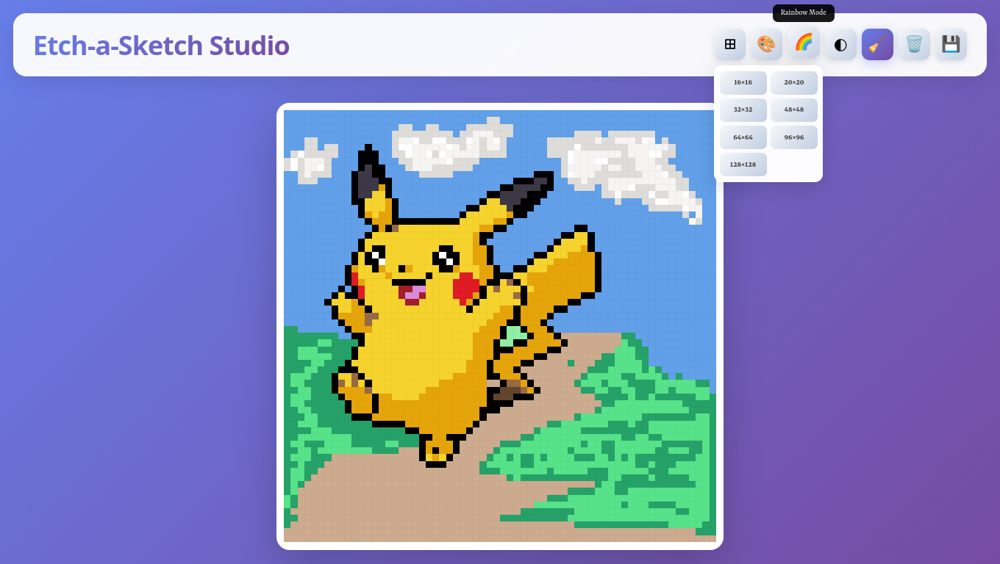

# Etch-a-Sketch Studio — Modern Pixel Art Application

[](https://opensource.org/licenses/MIT)
[](https://www.ecma-international.org/ecma-262/)
[](https://developer.mozilla.org/en-US/docs/Web/HTML)

> A sleek, browser-based pixel art creator with multiple drawing modes, customizable grid sizes, and image export functionality. Built with vanilla JavaScript for a smooth, responsive drawing experience.




[Live Demo](https://sid2169.github.io/sketch/) • [Report Bug](https://github.com/Sid2169/sketch/issues) • [Request Feature](https://github.com/Sid2169/sketch/issues)


---

## 📋 Table of Contents

- [Overview](#-overview)
- [Features](#-features)
- [Getting Started](#-getting-started)
- [Usage Guide](#-usage-guide)
- [Technical Implementation](#-technical-implementation)
- [Browser Support](#-browser-support)
- [Future Enhancements](#-future-enhancements)
- [Contributing](#-contributing)
- [License](#-license)

---

## 🎯 Overview

**Etch-a-Sketch Studio** is a modern take on the classic drawing toy, reimagined as a powerful pixel art creation tool. With an intuitive interface and versatile drawing modes, it enables users to create detailed pixel artwork directly in their browser—no downloads or installations required.

### Why Etch-a-Sketch Studio?

- **🎨 Multiple Drawing Modes**: Color picker, rainbow mode, shading, and eraser
- **📐 Flexible Grid Sizes**: From 16×16 to 128×128 pixels
- **💾 Export Capability**: Save your artwork as PNG images
- **⚡ Zero Dependencies**: Pure vanilla JavaScript (except html2canvas for export)
- **📱 Responsive Design**: Works seamlessly on desktop, tablet, and mobile
- **🎭 Modern UI**: Beautiful gradient themes with smooth animations

---

## ✨ Features

### Core Functionality

#### 🖌️ Drawing Tools
- **Color Picker**: Choose any color from the spectrum with the native color input
- **Rainbow Mode**: Each pixel gets a random vibrant color
- **Shading Tool**: Build up color gradually with progressive opacity (10% per stroke)
- **Eraser**: Remove pixels and return them to white
- **Click & Drag**: Natural drawing experience with mouse down/move events

#### 📏 Grid Customization
- **7 Grid Sizes Available**:
  - 16×16 (Beginner-friendly)
  - 20×20
  - 32×32 (Recommended)
  - 48×48
  - 64×64 (Detailed work)
  - 96×96
  - 128×128 (Maximum detail)
- **Confirmation Prompts**: Prevents accidental grid changes that would clear your work
- **Responsive Grid**: Maintains aspect ratio across all screen sizes

#### 💾 Image Export
- **PNG Format**: High-quality image output
- **Full Resolution**: Exports at actual grid resolution
- **html2canvas Integration**: Renders your pixel art with perfect fidelity
- **One-Click Download**: Automatic save as `pixel-art.png`

#### 🎨 Visual Design
- **Gradient Background**: Eye-catching purple-to-blue gradient
- **Tool Highlights**: Active tools show visual feedback
- **Hover Effects**: Subtle cell highlighting and smooth transitions
- **Tooltips**: Helpful labels appear on tool hover
- **Modern Typography**: Custom "Sekuya" font for headers

---

## 🚀 Getting Started

### Prerequisites

- Modern web browser with ES6+ support:
  - Chrome 90+
  - Firefox 88+
  - Safari 14+
  - Edge 90+

### Installation

#### Option 1: Direct Download
```bash
# Download the HTML file
curl -O https://github.com/Sid2169/index.html

# Open in your default browser
xdg-open index.html # Linux
open index.html  # macOS
start index.html # Windows

```

#### Option 2: Clone Repository
```bash
# Clone the repository
git clone https://github.com/Sid2169/sketch.git
cd sketch

# Open the file in your browser
# No build process required!
```

#### Option 3: Serve Locally
```bash
# Using Python 3
python -m http.server 8000

# Using Node.js http-server
npx http-server

# Then navigate to http://localhost:8000
```

---

## 📖 Usage Guide

### Basic Drawing

1. **Start Drawing**: Click and drag on the grid to draw
2. **Change Colors**: Click the 🎨 tool and select your color
3. **Try Rainbow Mode**: Click 🌈 for random colors on each pixel
4. **Erase Mistakes**: Click 🧹 to switch to eraser mode
5. **Clear Canvas**: Click 🗑️ to start fresh (with confirmation)

### Advanced Techniques

#### Shading
1. Select your base color with the color picker
2. Click the ◐ shading tool
3. Draw over the same area multiple times to darken (10% opacity per stroke)
4. Build up depth and dimension in your artwork

#### Grid Size Selection
1. Click the ⊞ grid tool to open the size menu
2. Select your desired resolution
3. Confirm the change (this will clear your current work)
4. Start drawing on your new canvas

#### Saving Your Work
1. Complete your pixel art masterpiece
2. Click the 💾 save button
3. Image automatically downloads as `pixel-art.png`
4. Use the saved image anywhere you like!

---

## 🏗️ Technical Implementation

### Architecture Overview

The application follows a **single-page, event-driven architecture** with clear separation between UI rendering and drawing logic.

```
┌─────────────────────────────────────┐
│         HTML Structure              │
│  • Header (toolbar)                 │
│  • Main (grid container)            │
│  • Embedded CSS & JavaScript        │
└─────────────────────────────────────┘
                 │
        ┌────────┴────────┐
        │                 │
┌───────▼────────┐ ┌─────▼──────────┐
│   UI Layer     │ │  Drawing Logic │
│                │ │                │
│ • Tool buttons │ │ • Color modes  │
│ • Grid menu    │ │ • Mouse events │
│ • Tooltips     │ │ • Cell state   │
└────────────────┘ └────────────────┘
```

### Key Components

#### 1. **Grid Generation System**
```javascript
function createNewGrid(size) {
  // Dynamically creates size × size grid
  // Uses nested loops for rows and columns
  // Attaches event listeners to each cell
}
```

**Features**:
- Dynamic grid creation with configurable dimensions
- Flexbox-based layout for perfect squares
- Individual cell event handling
- Maintains aspect ratio at all sizes

#### 2. **Drawing State Management**
```javascript
let colorMode = true;
let rainbowMode = false;
let shadingMode = false;
let eraseMode = false;
let penColor = '#000000';
let isDrawing = false;
```

**Pattern**:
- Boolean flags for mutually exclusive modes
- Global `isDrawing` state for drag functionality
- Active color tracking with CSS custom property sync

#### 3. **Mouse Event Handling**
```javascript
// Global drawing state
document.body.addEventListener('mousedown', () => {
  isDrawing = true;
});

// Per-cell drawing
gridCell.addEventListener('mouseover', () => {
  if (isDrawing) applyColor(gridCell);
});
```

**Approach**:
- Body-level mouse tracking prevents drag issues
- Cell-level hover events enable smooth drawing
- `mousedown` event for single-click coloring

#### 4. **Color Application Logic**
```javascript
function applyColor(gridCell) {
  // Handles 5 different modes:
  // 1. Standard color mode
  // 2. Color + shading (progressive opacity)
  // 3. Rainbow mode (random HSL)
  // 4. Rainbow + shading
  // 5. Eraser (reset to white)
}
```

**Shading Algorithm**:
```javascript
gridCell.style.opacity = Math.min(1, parseFloat(gridCell.style.opacity) + 0.1);
```
- Increments opacity by 10% per stroke
- Capped at 100% (fully opaque)
- Works with both color and rainbow modes

#### 5. **Image Export System**
```javascript
function downloadImage() {
  html2canvas(grid).then((canvas) => {
    const image = canvas.toDataURL('image/png');
    // Creates download link and triggers click
  });
}
```

**Libraries**:
- **html2canvas**: Converts DOM element to canvas
- Benefits: Preserves exact visual appearance
- Trade-off: Adds ~150KB dependency (CDN-hosted)

---

## 💡 Key Design Decisions

### 1. **Single-File Architecture**

**Decision**: Embed all CSS and JavaScript in the HTML file

**Rationale**:
- Zero build process required
- Easy to share and deploy
- Perfect for educational purposes
- No HTTP requests for local assets
- Instant loading time

**Trade-offs**:
- Larger file size (~15KB with compression)
- No code splitting (acceptable for this scope)

### 2. **Flexbox Grid System**

**Decision**: Use nested flex containers instead of CSS Grid

**Rationale**:
- Better cell aspect ratio control
- Simpler responsive behavior
- Consistent cross-browser rendering
- Easy to calculate cell sizes dynamically

**Implementation**:
```css
#grid { display: flex; flex-direction: column; }
.grid-row { display: flex; flex: 1; }
.grid-cell { flex: 1; }
```

### 3. **Opacity-Based Shading**

**Decision**: Implement shading by incrementing opacity rather than darkening color values

**Rationale**:
- Simpler math (no HSL/RGB conversion)
- Consistent behavior across all colors
- Visual feedback on each stroke
- Easy to understand and modify

**Formula**: `opacity = min(1, current_opacity + 0.1)`

### 4. **Global Mouse Tracking**

**Decision**: Track `mousedown`/`mouseup` on `document.body` instead of individual cells

**Rationale**:
- Prevents drawing interruption when mouse moves fast
- Cleaner code (single listener vs. hundreds)
- Better performance (fewer event listeners)
- Handles edge cases (mouse leaving grid)

### 5. **html2canvas for Export**

**Decision**: Use external library instead of manual canvas rendering

**Rationale**:
- Handles complex CSS properties automatically
- Maintains exact visual fidelity
- Well-tested and maintained library
- Saves development time
- CDN-hosted (no impact on file size)

**Alternative Considered**: Manual canvas rendering via `getComputedStyle()` (rejected for complexity)

### 6. **CSS-in-HTML Styling**

**Decision**: Use embedded `<style>` tag instead of external CSS

**Rationale**:
- Single-file portability
- No FOUC (Flash of Unstyled Content)
- Faster initial render (no CSS request)
- Easier for beginners to understand

### 7. **Confirmation Dialogs**

**Decision**: Show native browser confirms before destructive actions

**Rationale**:
- Prevents accidental work loss
- Zero UI complexity
- Universal browser support
- Clear user communication

---

## 🎨 Styling Highlights

### Gradient Theme
```css
body {
  background: linear-gradient(135deg, #667eea 0%, #764ba2 100%);
}
```
- Modern purple-to-blue gradient
- Matches "creative tools" aesthetic
- High contrast with white grid

### Glassmorphism Header
```css
header {
  background: rgba(255, 255, 255, 0.95);
  backdrop-filter: blur(10px);
  box-shadow: 0 8px 32px rgba(0, 0, 0, 0.1);
}
```
- Semi-transparent white background
- Blur effect for depth
- Subtle shadow for elevation

### Tool Button States
```css
.tools.highlight {
  background: linear-gradient(135deg, #667eea 0%, #764ba2 100%);
  box-shadow: 0 4px 16px rgba(102, 126, 234, 0.4);
  color: white;
}
```
- Active tools use gradient fill
- Glowing shadow for emphasis
- Clear visual feedback

### Responsive Tooltips
```css
.tools::after {
  content: attr(data-tooltip);
  /* Positioned above button */
  opacity: 0;
  transition: all 0.2s;
}

.tools:hover::after {
  opacity: 1;
  transform: translateX(-50%) scale(1);
}
```
- Pure CSS implementation
- Smooth fade-in animation
- No JavaScript required

---

## 🌐 Browser Support

### Fully Supported
- Chrome/Edge 90+ ✅
- Firefox 88+ ✅
- Safari 14+ ✅
- Opera 76+ ✅

### Feature Requirements
- ES6+ JavaScript (arrow functions, `let`/`const`)
- Flexbox layout
- CSS custom properties (`--variables`)
- Native color input (`<input type="color">`)
- Mouse events (`mousedown`, `mouseover`)

### Known Limitations
- Touch events not implemented (mobile drawing works but may be imprecise)
- html2canvas may have minor rendering differences in older browsers
- Color picker appearance varies by browser (native control)

---

## 🚧 Future Enhancements

### Planned Features

- [ ] **Touch Events**: Proper touch drawing for mobile devices
- [ ] **Undo/Redo**: History stack for reversing actions
- [ ] **Fill Tool**: Bucket fill for large areas
- [ ] **Eyedropper**: Sample colors from existing pixels
- [ ] **Grid Toggle**: Show/hide grid lines
- [ ] **Custom Grid Sizes**: Input any dimension from 8×8 to 256×256
- [ ] **Color Palettes**: Pre-defined color sets for quick access
- [ ] **Layers**: Basic layer support for complex artwork
- [ ] **Save/Load Projects**: JSON-based project files
- [ ] **Gallery**: View and load sample artwork

### Technical Improvements

- [ ] **LocalStorage**: Auto-save work in progress
- [ ] **Keyboard Shortcuts**: Power user efficiency
  - `C` - Color picker
  - `R` - Rainbow mode
  - `E` - Eraser
  - `Ctrl+Z` - Undo
  - `Ctrl+S` - Save
- [ ] **PWA Support**: Install as standalone app
- [ ] **WebGL Rendering**: Performance boost for large grids
- [ ] **Color History**: Remember recently used colors
- [ ] **Export Options**: SVG, JPEG, GIF formats
- [ ] **Grid Guides**: Overlay helper lines (thirds, golden ratio)

---

## 🤝 Contributing

Contributions are welcome! Since this is a single-file project, the process is straightforward:

1. **Fork the repository**
2. **Edit `index.html`** in your preferred editor
3. **Test thoroughly** across different browsers
4. **Commit your changes**: `git commit -m 'Add amazing feature'`
5. **Push to your fork**: `git push origin main`
6. **Open a Pull Request**

### Development Guidelines

- Maintain single-file architecture (no splitting into separate files)
- Keep code readable with comments for complex logic
- Test new features across Chrome, Firefox, and Safari minimum
- Ensure mobile responsiveness for any UI changes
- Update this README if adding features or changing behavior

---

## 📄 License

This project is licensed under the **MIT License** - see the LICENSE file for details.

---

## 👤 Author

**Your Name**

- GitHub: [@yourusername](https://github.com/Sid2169)
- Project Link: [Etch-a-Sketch Studio](https://github.com/Sid2169/sketch)

---

## 🙏 Acknowledgments

- **html2canvas** - Client-side screenshot library
- **Google Fonts** - Sekuya typeface
- **The Odin Project** - Project inspiration
- Classic Etch-a-Sketch toy for the original concept

---

## 📸 Screenshots

### Desktop View
*Grid with color picker and tools visible*

### Rainbow Mode
*Example artwork using rainbow mode with shading*

### Mobile View
*Responsive layout on tablet/phone*

---

<div align="center">

**Made with 🎨 and vanilla JavaScript**

If you enjoyed creating pixel art with this tool, please consider giving it a ⭐!

[Live Demo](#) • [Report Bug](#) • [Request Feature](#)

</div>